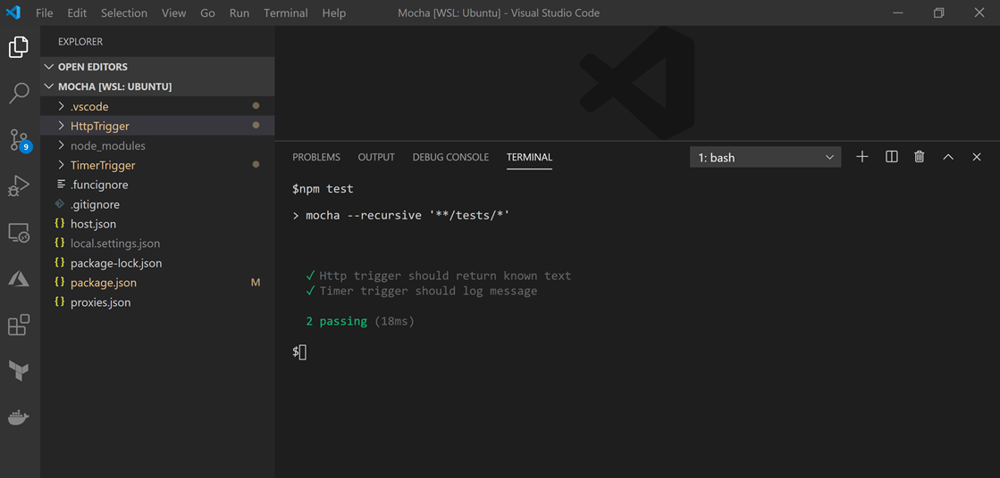

# Testing Azure functions using Mocha

This repository includes examples demonstrating how to run tests against an HTTP-triggered and timer-triggered function in JavaScript using  [Mocha](https://mochajs.org) and works best with [Visual Studio Code](https://code.visualstudio.com/).

Testing all code is recommended, however you may get the best results by wrapping up a Function's logic and creating tests outside the Function. Abstracting logic away limits a Function's lines of code and allows the Function to be solely responsible for calling other classes or modules. There are two functions with associated tests available, these examples include:

* HTTP-triggered function: The example demonstrates how to pass in query string parameters to the function.
* Timer-triggered function: A non-HTTP triggered function (in the form of a timer-triggered function) is included to demonstrate how to test a function that is not callable via a standard HTTP request.



To read more about the testing Azure functions, read [Strategies for testing your code in Azure Functions](https://docs.microsoft.com/azure/azure-functions/functions-test-a-function)


## Setup

This procedure uses the [VS Code Functions extension](https://marketplace.visualstudio.com/items?itemName=ms-azuretools.vscode-azurefunctions) to create Azure Functions

To set up your environment, initialize a new Node.js app in an empty folder by running `npm init`.

```bash
npm init -y
```

Next, install Mocha by running the following command:


```bash
npm i mocha chai sinon
```

Now update _package.json_ to replace the existing test command with the following command:

```bash
"scripts": {
    "test": "mocha --recursive '**/tests/*'"
}
```

### Create test modules

With the project initialized, you can create the modules used to run the automated tests.

Begin by creating a new Azure function using the VS Code Functions extension to [create a new JavaScript HTTP Function](/azure/javascript/tutorial-vscode-serverless-node-01) and name it *HttpTrigger*. Create new folders named *testing* and *test* to hold the support modules & test cases.

In the *testing* folder add a new file, name it **defaultContext.js**, and add the following code:

```javascript
var sinon = require('sinon');
module.exports = {
    log: sinon.stub()
};
```

This module mocks the *log* function to represent the default execution context.

In the **tests** folder create a new file named **index.test.js** and add the following code:

```javascript
var chai = require('chai');
const httpFunction = require('./index');
const context = require('../testing/defaultContext')
var expect = chai.expect;

it('Http trigger should return known text', async () => {

    const request = {
        query: { name: 'Bill' }
    };

    await httpFunction(context, request);

    expect(context.log.callCount).to.equal(1);
    expect(context.res.body).toEqual('Hello Bill');
});
```

The HTTP function from the template returns a string of "Hello" concatenated with the name provided in the query string. This test creates a fake instance of a request and passes it to the HTTP function. The test checks that the *log* method is called once and the returned text equals "Hello Bill".

Next, use the VS Code Functions extension to create a new JavaScript Timer Function and name it *TimerTrigger*. Once the function is created, add new folders **testing** and **tests**.

In the *testing* folder add 2 new files named **defaultContext.js** and **defaultTimer.js**.

In **defaultContext.js** add the following code:

```javascript
var sinon = require('sinon');
module.exports = {
    log: sinon.stub()
};
```

and in **defaultTimer.js** add the following code:

```javascript
module.exports = {
    IsPastDue: false
};
```

This module implements the `IsPastDue` property to stand is as a fake timer instance. Timer configurations like NCRONTAB expressions are not required here as the test harness is simply calling the function directly to test the outcome.

Now create a new file in the **tests** folder named **index.test.js**, and add the following code:

```javascript
var chai = require('chai');
const timerFunction = require('./index');
const context = require('../testing/defaultContext');
const timer = require('../testing/defaultTimer');
var expect = chai.expect;
it('Timer trigger should log message', () => {
    timerFunction(context, timer);
    expect(context.log.callCount).to.equal(1);
});
```

The timer function from the template logs a message at the end of the body of the function. This test ensures the *log* function is called once.

### Run tests

To run the tests, press **CTRL + ~** to open the command window, and run `npm test`:

```bash
npm test
```


### Debug tests

To debug your tests, add the following configuration to your *launch.json* file:

```json
{
    "type": "node",
    "request": "launch",
    "name": "Mocha Tests",
    "program": "${workspaceFolder}/node_modules/mocha/bin/_mocha",
    "args": 
    [
        "--timeout",
        "999999",
        "--colors",
        "'${workspaceFolder}/{,!(node_modules)/}*/*.test.js'"
    ],
  "internalConsoleOptions": "openOnSessionStart"
}
```

Next, set a breakpoint in your test and press **F5**.

## Contributing

This project welcomes contributions and suggestions.  Most contributions require you to agree to a
Contributor License Agreement (CLA) declaring that you have the right to, and actually do, grant us
the rights to use your contribution. For details, visit https://cla.opensource.microsoft.com.

When you submit a pull request, a CLA bot will automatically determine whether you need to provide
a CLA and decorate the PR appropriately (e.g., status check, comment). Simply follow the instructions
provided by the bot. You will only need to do this once across all repos using our CLA.

This project has adopted the [Microsoft Open Source Code of Conduct](https://opensource.microsoft.com/codeofconduct/).
For more information see the [Code of Conduct FAQ](https://opensource.microsoft.com/codeofconduct/faq/) or
contact [opencode@microsoft.com](mailto:opencode@microsoft.com) with any additional questions or comments.
